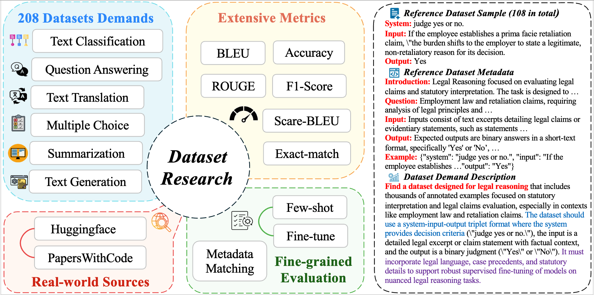

# DatasetResearch: Benchmarking Agent Systems for Demand-Driven Dataset Discovery

[](https://arxiv.org/abs/2508.06960)
[](https://huggingface.co/datasets/GAIR/DatasetResearch)
[](https://opensource.org/licenses/Apache-2.0)
[](https://www.python.org/downloads/release/python-3100/)

**Official implementation for the paper "DatasetResearch: Benchmarking Agent Systems for Demand-Driven Dataset Discovery"**



The first comprehensive benchmark for evaluating AI agents' ability to discover and synthesize datasets from real-world demands across knowledge-intensive and reasoning-intensive tasks. Our tri-dimensional evaluation framework reveals that even advanced systems achieve only 20% accuracy, establishing rigorous baselines for autonomous dataset discovery and illuminating the path toward AI capable of finding any dataset in the digital universe.

## 🚀 Features

- **Automated Dataset Discovery Baseline**: Search and discover relevant datasets using LLM-powered agents
- **Complete Evaluation Pipeline**: End-to-end evaluation framework with SFT training, inference, and assessment
- **LLaMA-Factory Integration**: Seamless integration with LLaMA-Factory for model training and inference
- **Comprehensive Metrics**: Multiple evaluation metrics including BLEU, ROUGE, F1, exact match, and accuracy


## 🛠️ Quick Setup

We provide a one-click setup script that handles everything:

```bash
# Clone the repository
git clone https://github.com/GAIR-NLP/DatasetResearch
cd DatasetResearch

# Run the setup script (installs uv, dependencies, downloads data, sets up CLI)
chmod +x setup.sh
./setup.sh
```

After setup completes, the CLI is ready to use! The script will show you exactly how to run commands:

```bash
# If global command is available:
datasetresearch --help

# Otherwise use from project directory:
./datasetresearch --help
```

### Manual Installation (Alternative)

If you prefer manual setup:

```bash
# Install dependencies
uv sync  # or pip install -r requirements.txt

# Set up LLaMA-Factory
cd LLaMA-Factory
pip install -e ".[torch,metrics]"
cd ..

# Make CLI executable
chmod +x datasetresearch
source .venv/bin/activate
```

## 🎯 Quick Start

The Deep Dataset Researcher provides a unified CLI interface for all operations. Use the `datasetresearch` command to access all functionality.

### CLI Overview

```bash
# View all available commands
datasetresearch --help

# Get help for specific commands
datasetresearch search --help
datasetresearch synthesis --help
datasetresearch register --help
datasetresearch run --help
datasetresearch eval --help
datasetresearch metaeval --help
```

### 1. Dataset Search Baseline Method

Search for relevant datasets using the CLI:

```bash
# Search for datasets using default configuration
datasetresearch search

# Search with custom configuration
datasetresearch search --config configs/search_config.yaml
```

**New ID Format**: Search datasets now use standardized IDs:
- **Format**: `search_{selected_dataset}_{model}`
- **Example**: `search_alpaca_gpt4_gemini`, `search_dolly_15k_o3`

### 2. Dataset Synthesis Baseline Method

Generate synthetic training data using the CLI:

```bash
# Generate synthetic data with default settings
datasetresearch synthesis

# Generate data with custom configuration
datasetresearch synthesis --config configs/generation_config.yaml

# Generate with specific metadata file
datasetresearch synthesis \
    --metadata-file datasets/search_results.json \
    --output-dir experiments/generation/
```

**New ID Format**: Synthesis datasets now use standardized IDs:
- **Format**: `synthesis_{original_dataset_id}_{model}`
- **Example**: `synthesis_math_problems_o3`, `synthesis_code_snippets_gemini`

### 3. Dataset Registration

Register datasets with LLaMA-Factory for training:

```bash
# Register search datasets
datasetresearch register \
    --metadata-file datasets/search_results.json \
    --output-file LLaMA-Factory/data/dataset_info.json \
    --base-dir search_dataset \
    --model gemini

# Register synthesis datasets  
datasetresearch register \
    --metadata-file datasets/generation_results.json \
    --output-file LLaMA-Factory/data/dataset_info.json \
    --base-dir synthesis \
    --model o3
```


### 4. Model Training and Evaluation (Full Pipeline)

Execute complete SFT training and inference:

```bash
# Run with specific configuration and model
datasetresearch run \
  --config evaluation/config_few_shot.yaml \
  --dataset_json datasets/results/re_eval/gpt-4o-mini.json \
  --model llama3_8b \
  --task_model gpt-4o-search-preview \
```

### 5. Evaluation Pipeline

Use the evaluation pipeline for comprehensive assessment:

```bash
# Run complete evaluation pipeline
datasetresearch eval

# Run evaluation with specific dataset set
datasetresearch eval --set mini

# Run with custom configurations
datasetresearch eval \
    --eval-config evaluation/config.yaml \
    --pipeline-config configs/pipeline_settings.yaml
```

### 6. Metadata Evaluation

Run metadata evaluation pipeline:

```bash
# Run full metadata evaluation
datasetresearch metaeval

# Run with specific configuration
datasetresearch metaeval --config configs/evaluate_metadata_config.yaml

# Run specific modes
datasetresearch metaeval --mode generate_only
datasetresearch metaeval --mode evaluate_only
```

## 🖥️ CLI Usage Examples

### CLI Command Reference

| Command | Purpose | Key Options |
|---------|---------|-------------|
| `search` | Dataset discovery | `--config`, `--dry-run` |
| `synthesis` | Data generation | `--config`, `--metadata-file`, `--num-data`, `--dry-run` |
| `register` | Dataset registration | `--metadata-file`, `--output-file`, `--base-dir`, `--model` |
| `run` | Training/inference | `--config` (required), `--model`, `--step`, `--dry-run` |
| `eval` | Evaluation pipeline | `--eval-config`, `--pipeline-config`, `--set`, `--dry-run` |
| `metaeval` | Metadata evaluation | `--config`, `--mode`, `--dry-run` |

## 📈 Results and Outputs

### Dataset Search Results
- `experiments/search/`: Search results and discovered datasets
- `datasets/search_set_metadata_*.json`: Metadata for discovered datasets
- **New**: Standardized `search_{dataset}_{model}` IDs throughout

### Synthetic Data Generation
- `datasets/generation_metadata_*.json`: Generated training data metadata
- **New**: Files saved with `synthesis_{dataset}_{model}` naming convention
- **New**: Consistent ID usage across w_example and wo_example outputs

### Dataset Registration
- `LLaMA-Factory/data/dataset_info.json`: Registered datasets for training
- **New**: Direct mapping from `search_dataset_id` to dataset keys
- **New**: File paths match `{base_dir}/{model}/{search_dataset_id}.json`

### Evaluation Results
- `evaluation/results/final_results/`: Individual evaluation JSON files
- `evaluation/results/evaluation_summary.csv`: Unified CSV output from integrated pipeline
- `evaluation/processed_results/`: Aggregated performance metrics

## 🔧 Configuration

The framework uses multiple configuration files for different components:

### API Configuration

All API configurations are managed through configuration files instead of environment variables. Update the respective config files with your API credentials:

#### Search Configuration (`configs/search_config.yaml`)
```yaml
# Search model configuration
search_model_name: "openai/gpt-4o-mini-search-preview"
search_api_base: "https://openrouter.ai/api/v1"  
search_api_key: "your-openrouter-key"

# Generation model configuration  
model_name: "o3"
model_api_base: "https://gpt.yunstorm.com/"
model_api_key: "your-azure-key"
```

#### Generation Configuration (`configs/generation_config.yaml`)
```yaml
# Azure OpenAI API configuration
azure_openai:
  api_endpoint: "https://your-azure-endpoint"
  api_key: "your-azure-key"
  api_version: "2025-01-01-preview"
  model: "o3"
```

#### Metadata Generation Configuration (`configs/evaluate_metadata_config.yaml`)
```yaml
# LLM configuration for metadata generation
llm_config:
  api_model: "o3"
  api_base: "https://gpt.yunstorm.com/"
  api_key: "your-azure-key"
```

**Note**: Replace the placeholder keys with your actual API credentials. All modules now use configuration files exclusively - environment variables are no longer supported.

### SFT Model Configuration (`evaluation/config.yaml`)

```yaml
models:
  llama3_8b:
    name: "llama3_8b"
    base_model: "models/LLama3/Llama-3.1-8B"
    template: "llama3"
    finetuning_type: "full"
    batch_size: 1
    learning_rate: 1.0e-5
```

### Evaluation Pipeline Configuration (`configs/pipeline_settings.yaml`)

```yaml
target_data_models:
  gpt-4o-search-preview:
    display_name: "gpt-4o-search"
  o3-w:
    display_name: "gpt-o3"
    
evaluation_settings:
  sft_model: "llama3_8b"
  methods:
    fine_tune:
      display_name: "fine-tune"
    zero_shot:
      display_name: "0-shot"
```

## 📚 Citation

If you use this framework in your research, please cite our paper:

```bibtex
@misc{li2025datasetresearchbenchmarkingagentsystems,
      title={DatasetResearch: Benchmarking Agent Systems for Demand-Driven Dataset Discovery}, 
      author={Keyu Li and Mohan Jiang and Dayuan Fu and Yunze Wu and Xiangkun Hu and Dequan Wang and Pengfei Liu},
      year={2025},
      eprint={2508.06960},
      archivePrefix={arXiv},
      primaryClass={cs.AI},
      url={https://arxiv.org/abs/2508.06960}, 
}
```

## 🤝 Contributing

1. Fork the repository
2. Create a feature branch
3. Make your changes
4. Add tests if applicable  
5. Submit a pull request

## 📄 License

This project is licensed under the Apache License 2.0. See the [LICENSE](LICENSE) file for details.

## 🙋‍♂️ Support

For questions, issues, or contributions:

- 📧 **Issues**: [Open an issue](https://github.com/GAIR-NLP/DatasetResearch/issues) in the GitHub repository
- 📚 **Documentation**: Check `evaluation/README.md` for detailed evaluation framework docs
- 🗄️ **Data**: Access test datasets at [🤗 GAIR/DatasetResearch](https://huggingface.co/datasets/GAIR/DatasetResearch)
- 💬 **CLI Help**: Use `datasetresearch --help` or `datasetresearch <command> --help`
- 🔧 **Setup Issues**: Run `./setup.sh` for automated setup and troubleshooting

## 🔬 Research Applications

This framework is designed for:

- **Agent System Benchmarking**: Compare different agent systems for dataset discovery
- **Dataset Quality Assessment**: Evaluate and compare dataset quality with standardized metrics
- **Model Performance Analysis**: Comprehensive model evaluation across tasks and domains


## 📁 Project Structure

```
DatasetResearch/
├── setup.sh                    # One-click setup script with environment and data setup
├── datasetresearch             # CLI entry point
├── datasetresearch_cli/        # CLI implementation
│   ├── commands/              # CLI command modules
│   │   ├── search.py         # Dataset search command
│   │   ├── synthesis.py      # Data synthesis command  
│   │   ├── run.py           # Training/inference command
│   │   ├── eval.py          # Evaluation command
│   │   ├── register.py      # Dataset registration command
│   │   └── metaeval.py      # Metadata evaluation command
│   ├── core/                 # Core CLI functionality
│   └── utils/                # CLI utilities
├── LLaMA-Factory/              # Integrated LLaMA-Factory for model training
├── bash_scripts/               # Automation scripts for data processing and evaluation
├── configs/                    # Configuration files for different experiments
├── datasets/                   # Dataset storage and metadata
│   ├── results/               # Processed evaluation results
│   └── metadata files         # Dataset metadata and search results
├── evaluation/                 # Evaluation framework
│   ├── evaluators/            # Task-specific evaluators
│   ├── results/               # Evaluation outputs
│   └── templates/             # Evaluation templates
├── experiments/                # Experiment results and configurations
│   ├── generation/            # Synthetic data generation experiments
│   └── search/               # Dataset search experiments
├── metrics/                   # Custom evaluation metrics
├── scripts/                   # Core functionality scripts
│   ├── dataset/              # Dataset processing utilities
│   ├── method/               # Search and generation agents
│   └── utils/                # Utility functions
├── assets/                    # Images and static files
│   └── teaser_1.pdf          # Paper teaser figure
└── downloaded_datasets/       # Raw downloaded datasets
```